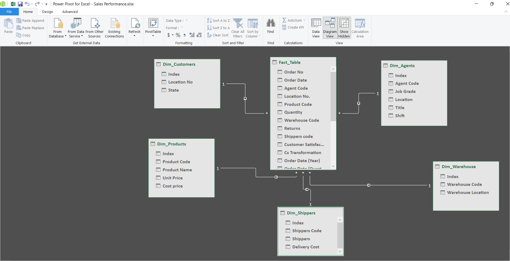
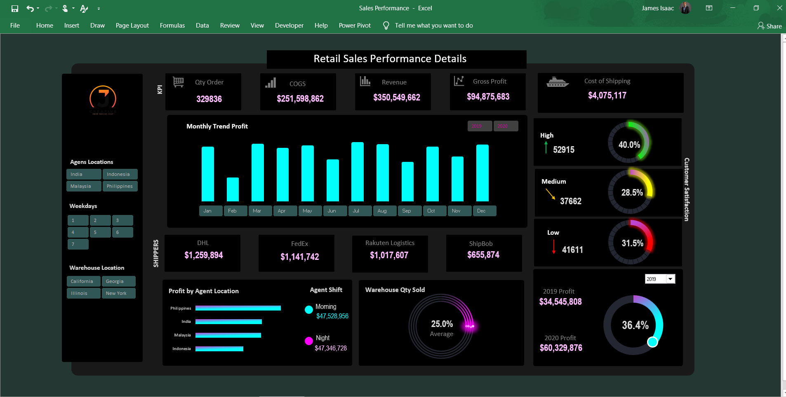

# Retail Sales Performance Dashboard – Excel Project

## Introduction
In this project, I developed an interactive Retail Sales Performance Dashboard to analyze order trends, revenue, profitability, shipping costs, agent performance, and customer satisfaction. The dashboard provides a comprehensive view of sales data across multiple dimensions, enabling stakeholders to make data-driven business decisions.

The dataset consists of six key tables (Orders, Products, Agents, Shippers, Warehouse, and Location), which were structured and related using Power Pivot’s Data Model in a Star Schema (1:*) for efficient analysis.

## About the Dataset
The dataset contains information from a retail business, structured into six main tables:
- Orders – Contains details of customer purchases, including quantity, revenue, cost, and date.
- Products – Information on product categories, prices, and inventory levels.
- Agents – Sales representatives managing customer orders across different locations.
- Shippers – Logistics companies responsible for delivering orders.
- Warehouse – Stock levels, shipment details, and warehouse performance.
- Location – Geographic details of warehouses, customers, and sales agents.
  
The tables were structured using Power Pivot in Excel and connected through a Star Schema (1:*), where the Orders table acted as the central fact table, and the rest were dimension tables for enhanced analytics.

## Problem Statement
The business needed a centralized system to track sales performance, agent efficiency, shipping costs, and customer satisfaction trends. Key challenges included:
- Lack of visibility into order trends and revenue fluctuations.
- Delays in shipment tracking and cost analysis leading to inefficiencies.
- Agent performance inconsistencies across different locations.
- Warehouse stock and sales tracking required for demand forecasting.
- Data scattered across multiple tables, making manual analysis time-consuming.
To address these issues, I built a fully interactive dashboard that integrates all data into a single view, enabling real-time insights and performance tracking.

## Excel Concepts Applied
To create this dashboard, I applied several Excel tools and techniques, ensuring accuracy, automation, and interactivity.

#### 1. Data Modeling & Management: 
- Power Pivot / Data Model – Structured data using Star Schema (1:*) for optimized relationships.
- Power Query – Cleaned, transformed, and loaded data for seamless integration.

#### 2. Advanced Data Analysis: 
Pivot Tables & Pivot Charts – Created dynamic reports for sales trends and performance tracking.
DAX (Data Analysis Expressions) – Used measures and calculated columns for advanced metrics (e.g., profit margin, year-over-year growth).
#### 3. Dashboard Interactivity & Automation: 
- Slicers & Timelines – Added filters for years, locations, warehouses, and agents.-
- Conditional Formatting – Highlighted trends and performance insights.
Dropdown Menus & Data Validation – Enabled user-friendly selection of key metrics.
#### 4. Financial & Performance Metrics: 
- Profit Margin Analysis – Tracked revenue, cost of goods sold (COGS), and net profit.
- Customer Satisfaction Scores – Measured feedback and quality of service.
- Shipping Cost Efficiency – Assessed delivery expenses versus revenue.
These Excel techniques helped in automating processes, reducing manual effort, and making insights easily accessible.

## Insights from the Dashboard
The dashboard provides a comprehensive breakdown of sales, revenue, and agent performance. Key insights include:

 [Watch Video](https://drive.google.com/file/d/17xsTVBKnq4z0sw3z0wE56iRd_B7S034C/view?usp=sharing)

#### 1. Order & Revenue Trends
- Total orders: 329,836
- Revenue: $350,549,662
- COGS: $251,598,862
- Gross Profit: $94,875,683
Highest revenue in August and lowest in March based on monthly trends.

#### 2. Shipping Cost & Logistics Efficiency
- Total Shipping Cost: $4,075,117
- Top Shipper: DHL ($1,259,894 revenue generated)
- High delivery success rate (40% in green zone), but 31.5% in low satisfaction (red zone), requiring improvements.
  
#### 3. Agent Performance & Location-Based Profitability
- Top-performing location: Philippines – $47,528,956 in morning shifts.
- India and Malaysia show steady profits, but Indonesia has lower sales performance.
- Night shifts generate almost equal revenue as morning shifts, indicating balanced productivity.

#### 4. Warehouse & Inventory Management
- Warehouse Sales Contribution: 25% average sales from warehouse stock.
- High-volume locations: California and Georgia warehouses.
- Stock levels in Illinois and New York warehouses require optimization.
These insights provide a data-driven approach to improving sales, logistics, and agent efficiency.

## Conclusion & Recommendations

#### Key Takeaways
- Revenue is strong, but profitability can be improved by optimizing shipping costs.
- Agent performance varies by location, requiring targeted sales strategies.
- Customer satisfaction scores indicate areas for service improvement.
- Warehouse stock levels and distribution need rebalancing for efficiency.

#### Recommendations for Business Improvement
- Optimize shipping cost strategies by renegotiating logistics contracts.
- Improve customer service initiatives to reduce low satisfaction ratings.
- Enhance agent training programs in underperforming locations.
- Balance warehouse stock levels based on demand forecasting insights.
This dashboard provides a holistic view of retail performance, enabling business leaders to drive growth, improve efficiency, and enhance customer satisfaction.
- ✅ Created by: James Isaac
- ✅ Built with: Microsoft Excel (Power Pivot, Power Query, Pivot Tables)
- ✅ Data Source: Online
